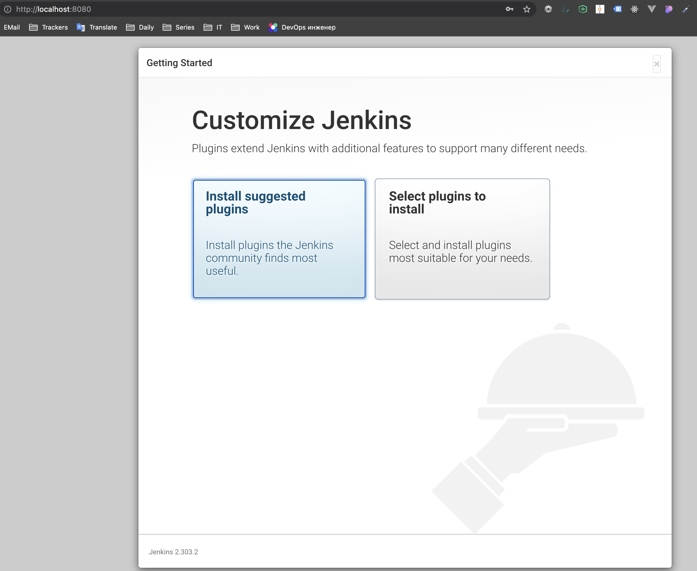

# Домашнее задание к занятию "5.4. Практические навыки работы с Docker"

## Задача 1 

В данном задании вы научитесь изменять существующие Dockerfile, адаптируя их под нужный инфраструктурный стек.

Измените базовый образ предложенного Dockerfile на Arch Linux c сохранением его функциональности.

```text
FROM ubuntu:latest

RUN apt-get update && \
    apt-get install -y software-properties-common && \
    add-apt-repository ppa:vincent-c/ponysay && \
    apt-get update
 
RUN apt-get install -y ponysay

ENTRYPOINT ["/usr/bin/ponysay"]
CMD ["Hey, netology”]
```

Для получения зачета, вам необходимо предоставить:
- Написанный вами Dockerfile

```
FROM archlinux:latest

RUN pacman -Sy && \
pacman -S ponysay --noconfirm
 
ENTRYPOINT ["/usr/bin/ponysay"]
CMD ["Hey, netology”]
```

- Скриншот вывода командной строки после запуска контейнера из вашего базового образа


- Ссылку на образ в вашем хранилище docker-hub
  
https://hub.docker.com/repository/docker/ksedline/ponysay-arch

## Задача 2 

В данной задаче вы составите несколько разных Dockerfile для проекта Jenkins, опубликуем образ в `dockerhub.io` и посмотрим логи этих контейнеров.

- Составьте 2 Dockerfile:

    - Общие моменты:
        - Образ должен запускать [Jenkins server](https://www.jenkins.io/download/)
        
    - Спецификация первого образа:
        - Базовый образ - [amazoncorreto](https://hub.docker.com/_/amazoncorretto)
        - Присвоить образу тэг `ver1` 
    
    - Спецификация второго образа:
        - Базовый образ - [ubuntu:latest](https://hub.docker.com/_/ubuntu)
        - Присвоить образу тэг `ver2` 

- Соберите 2 образа по полученным Dockerfile
- Запустите и проверьте их работоспособность
- Опубликуйте образы в своём dockerhub.io хранилище

Для получения зачета, вам необходимо предоставить:
- Наполнения 2х Dockerfile из задания

  Correto:

  ```
  FROM amazoncorretto:latest

  ADD https://get.jenkins.io/war-stable/latest/jenkins.war /root/
  WORKDIR /root
  EXPOSE 8080
  ENTRYPOINT ["java"]
  CMD ["-jar","jenkins.war"]
  ```
  
  Ubuntu:
  
  ```
  FROM ubuntu:latest

  RUN apt-get update && apt-get install -y openjdk-11-jdk

  ADD https://get.jenkins.io/war-stable/latest/jenkins.war /root/
  WORKDIR /root
  EXPOSE 8080
  ENTRYPOINT ["java"]
  CMD ["-jar","jenkins.war"]
  ```

- Скриншоты логов запущенных вами контейнеров (из командной строки)

  Correto:

  

  Ubuntu:

  

- Скриншоты веб-интерфейса Jenkins запущенных вами контейнеров (достаточно 1 скриншота на контейнер)

  (Я залогинился, чтбы проверить, что работает и дальше не стал ставить плагины)

  Correto:

  

  Ubuntu:

  


- Ссылки на образы в вашем хранилище docker-hub

  https://hub.docker.com/repository/docker/ksedline/correto-jenkins

  https://hub.docker.com/repository/docker/ksedline/ubuntu-jenkins


## Задача 3 

В данном задании вы научитесь:
- объединять контейнеры в единую сеть
- исполнять команды "изнутри" контейнера

Для выполнения задания вам нужно:
- Написать Dockerfile: 
    - Использовать образ https://hub.docker.com/_/node как базовый
    - Установить необходимые зависимые библиотеки для запуска npm приложения https://github.com/simplicitesoftware/nodejs-demo
    - Выставить у приложения (и контейнера) порт 3000 для прослушки входящих запросов  
    - Соберите образ и запустите контейнер в фоновом режиме с публикацией порта

- Запустить второй контейнер из образа ubuntu:latest 
- Создайть `docker network` и добавьте в нее оба запущенных контейнера
- Используя `docker exec` запустить командную строку контейнера `ubuntu` в интерактивном режиме
- Используя утилиту `curl` вызвать путь `/` контейнера с npm приложением  

Для получения зачета, вам необходимо предоставить:
- Наполнение Dockerfile с npm приложением

  ```
  FROM node:latest

  RUN wget -P /usr/app https://github.com/simplicitesoftware/nodejs-demo/archive/refs/heads/master.zip && cd /usr/app && unzip master.zip

  WORKDIR /usr/app/nodejs-demo-master

  RUN npm install

  EXPOSE 3000
  ENTRYPOINT ["npm"]

  CMD ["start", "0.0.0.0", "3000"]
  ```

  Изящное переключение с 'localhost', на '0.0.0.0' через аргументы, т.к. в коде NodeJS приложения, для конфигурации следующие строки:

  ```
  const serverHost = process.env.VCAP_APP_HOST || args[0] || 'localhost';
	const serverPort = process.env.VCAP_APP_PORT || parseInt(args[1]) || 3000;
  ```

  За Server Host берем первый аргумент при запуске и опционально указываем второй аргумент как Server Port.
  Еще можно было указать переменные окружения в Dockerfile (VCAP_APP_HOST и опционально VCAP_APP_PORT).

- Скриншот вывода вызова команды списка docker сетей (docker network cli)

  ```
  node git:(main) ✗ docker network ls
  NETWORK ID     NAME      DRIVER    SCOPE
  8a37e60a93b6   bridge    bridge    local
  4ebff6642b49   host      host      local
  d8be84ef7bbc   node      bridge    local
  691dcbdc993d   none      null      local
  ```
  
- Скриншот вызова утилиты curl с успешным ответом

  ```
  ➜  node git:(main) ✗ docker exec -it ubuntu bash
  root@51dc4f82291c:/# curl -I node-test:3000/
  HTTP/1.1 200 OK
  Cache-Control: private, no-cache, no-store, no-transform, must-revalidate
  Expires: -1
  Pragma: no-cache
  Content-Type: text/html; charset=utf-8
  Content-Length: 524711
  ETag: W/"801a7-5idY85N3dYm3OotarmLxm4/KqEw"
  Date: Wed, 06 Oct 2021 22:32:08 GMT
  Connection: keep-alive
  Keep-Alive: timeout=5

  root@51dc4f82291c:/# 
  ```

---

### Как cдавать задание

Выполненное домашнее задание пришлите ссылкой на .md-файл в вашем репозитории.

---
