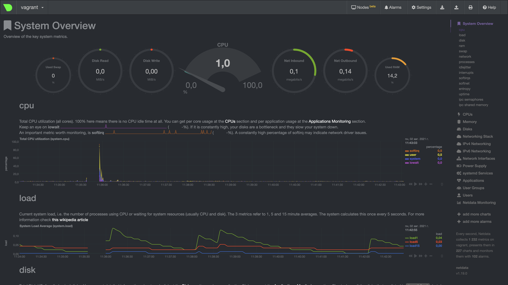

1. На лекции мы познакомились с [node_exporter](https://github.com/prometheus/node_exporter/releases). В демонстрации его 
   исполняемый файл запускался в background. Этого достаточно для демо, но не для настоящей production-системы, где 
   процессы должны находиться под внешним управлением. Используя знания из лекции по systemd, создайте самостоятельно простой 
   [unit-файл](https://www.freedesktop.org/software/systemd/man/systemd.service.html) для node_exporter:

   * поместите его в автозагрузку,
   * предусмотрите возможность добавления опций к запускаемому процессу через внешний файл (посмотрите, например, на `systemctl cat cron`),
   * удостоверьтесь, что с помощью systemctl процесс корректно стартует, завершается, а после перезагрузки автоматически поднимается.
   

Инсталяция:  

```bash
$ wget https://github.com/prometheus/node_exporter/releases/download/v1.2.0/node_exporter-1.2.0.linux-amd64.tar.gz
$ tar xvfz node_exporter-1.2.0.linux-amd64.tar.gz
$ cd node_exporter-1.2.0-amd64/
$ mv node_exporter-1.2.0.linux-amd64/ node_exporter/
$ cd /etc/systemd/system
$ nano node-exporter.service
```

И пишем в файл

```
[Unit]
Description=Node Exporter
 
[Service]
ExecStart=/home/vagrant/node_exporter-1.2.0.linux-amd64/node_exporter ${OPTION_1} ${OPTION_2}
EnvironmentFile=/home/vagrant/node_exporter/env
 
[Install]
WantedBy=multi-user.target
```

Затем
  
```bash
$ sudo systemctl enable node-exporter.service
```

Запуск

```bash
sudo systemctl start node-exporter.service
```

Проверки

```bash

$ systemctl list-unit-files --type=service | grep node-exporter
$ node-exporter.service                  enabled         enabled      
$ ps aux | grep node-exporter
$ vagrant     1611  0.0  0.0   9032   736 pts/0    S+   00:29   0:00 grep --color=auto node-exporter
$ sudo systemctl restart node-exporter.service
$ ps aux | grep node-exporter
$ root        1616  0.0  1.1 714768 11580 ?        Ssl  00:30   0:00 /home/vagrant/node_exporter/node_exporter
$ vagrant     1632  0.0  0.0   8900   672 pts/0    S+   00:30   0:00 grep --color=auto node_ex
$ sudo cat /proc/1616/environ
$ LANG=en_US.UTF-8LANGUAGE=en_US:PATH=/usr/local/sbin:/usr/local/bin:/usr/sbin:/usr/bin:/sbin:/bin:/snap/binINVOCATION_ID=ee1f96f4138f46be8e7f5c096fd19642JOURNAL_STREAM=9:31245
```

2. Ознакомьтесь с опциями node_exporter и выводом `/metrics` по умолчанию. Приведите несколько опций, которые вы бы 
   выбрали для базового мониторинга хоста по CPU, памяти, диску и сети.

CPU:

```  
node_cpu_seconds_total{cpu="0",mode="user"}
node_cpu_seconds_total{cpu="0",mode="idle"}  
node_cpu_seconds_total{cpu="0",mode="iowait"}  
node_cpu_seconds_total{cpu="0",mode="system"}  

node_cpu_seconds_total{cpu="1",mode="user"}
node_cpu_seconds_total{cpu="1",mode="idle"}  
node_cpu_seconds_total{cpu="1",mode="iowait"}  
node_cpu_seconds_total{cpu="1",mode="system"}  

process_cpu_seconds_total  
```


Memory: 

``` 
node_memory_MemAvailable_bytes  
node_memory_MemFree_bytes  
```

Диски:  

```
node_disk_io_time_seconds_total{device="sda"}
node_disk_read_bytes_total{device="sda"}  
node_disk_read_time_seconds_total{device="sda"}  
node_disk_written_bytes_total{device="sda"}
node_disk_write_time_seconds_total{device="sda"}  
```

Сеть: 

```
node_network_receive_bytes_total{device="eth0"}  
node_network_receive_errs_total{device="eth0"}  
node_network_transmit_bytes_total{device="eth0"}  
node_network_transmit_errs_total{device="eth0"}
```

Получил Все данные через ```curl localhost:9100/metric | grep cpu```

3. Установите в свою виртуальную машину [Netdata](https://github.com/netdata/netdata). 
   Воспользуйтесь [готовыми пакетами](https://packagecloud.io/netdata/netdata/install) для установки (`sudo apt install -y netdata`). 
   После успешной установки:
   * в конфигурационном файле `/etc/netdata/netdata.conf` в секции [web] замените значение с localhost на `bind to = 0.0.0.0`,
   * добавьте в Vagrantfile проброс порта Netdata на свой локальный компьютер и сделайте `vagrant reload`:

    ```bash
    config.vm.network "forwarded_port", guest: 19999, host: 19999
    ```

   После успешной перезагрузки в браузере *на своем ПК* (не в виртуальной машине) вы должны суметь зайти на `localhost:19999`. 
   Ознакомьтесь с метриками, которые по умолчанию собираются Netdata, и с комментариями, которые даны к этим метрикам.

NetData

```
cat /etc/netdata/netdata.conf
# NetData Configuration

# The current full configuration can be retrieved from the running
# server at the URL
#
#   http://localhost:19999/netdata.conf
#
# for example:
#
#   wget -O /etc/netdata/netdata.conf http://localhost:19999/netdata.conf
#

[global]
	run as user = netdata
	web files owner = root
	web files group = root
	# Netdata is not designed to be exposed to potentially hostile
	# networks. See https://github.com/netdata/netdata/issues/164
        bind socket to IP = 127.0.0.1
[web]
        default port = 19999
        bind to = 0.0.0.0
```

Метрики:



4. Можно ли по выводу `dmesg` понять, осознает ли ОС, что загружена не на настоящем оборудовании, а на системе виртуализации?

Осознает

```
$ dmesg | grep -i virtual

$
[    0.000000] DMI: innotek GmbH VirtualBox/VirtualBox, BIOS VirtualBox 12/01/2006
[    0.003624] CPU MTRRs all blank - virtualized system.
[    0.144571] Booting paravirtualized kernel on KVM
[    2.506173] systemd[1]: Detected virtualization oracle.
```

5. Как настроен sysctl `fs.nr_open` на системе по-умолчанию? Узнайте, что означает этот параметр. Какой другой существующий лимит не 
   позволит достичь такого числа (`ulimit --help`)?  
   
Ответ:

```bash
$ cat /proc/sys/fs/nr_open
1048576
$ /sbin/sysctl -n fs.nr_open
1048576
```  
nr_open - Максимальное число открытых дескрипторов файлов. 

По умолчанию - 1024^2 - 1048576.

Результат `ulimit`:  

```bash
$ ulimit -n
1024
$ ulimit -Sn
1024
$ ulimit -Hn
1048576
```  

`ulimit -n`, `ulimit -Sn` - это мягкая версия лимитирования ресурсов

`ulimit -Hn` - это жесткая версия лимитирования ресурсов


6. Запустите любой долгоживущий процесс (не `ls`, который отработает мгновенно, а, например, `sleep 1h`) в 
   отдельном неймспейсе процессов; покажите, что ваш процесс работает под PID 1 через `nsenter`. Для простоты 
   работайте в данном задании под root (`sudo -i`). Под обычным пользователем требуются дополнительные опции (`--map-root-user`) и т.д.
   

Терминал 1:  

```bash
$ sudo -i
root@vagrant:~# unshare -f --pid --mount-proc /bin/bash
root@vagrant:~# sleep 1h &
```  

Терминал 2:

```bash
$ sudo -i
root@vagrant:~# ps aux | grep sleep
root        1406  0.0  0.0   8076   592 pts/0    S+   08:54   0:00 sleep 1h
root        1491  0.0  0.0   8900   740 pts/1    S+   08:56   0:00 grep --color=auto sleep
root@vagrant:~# nsenter --target 1406 --pid --mount
root@vagrant:/# ps aux
USER         PID %CPU %MEM    VSZ   RSS TTY      STAT START   TIME COMMAND
root           1  0.0  0.4   9836  4024 pts/0    S    08:54   0:00 /bin/bash
root           9  0.0  0.3   9836  3972 pts/1    S    08:57   0:00 -bash
root          19  0.0  0.0   8076   592 pts/0    S+   08:57   0:00 sleep 1h
root          20  0.0  0.3  11492  3256 pts/1    R+   08:58   0:00 ps aux
```

7. Найдите информацию о том, что такое `:(){ :|:& };:`. Запустите эту команду в своей виртуальной машине Vagrant с Ubuntu 20.04 
   (**это важно, поведение в других ОС не проверялось**). Некоторое время все будет "плохо", после чего (минуты) – ОС должна стабилизироваться. 
   Вызов `dmesg` расскажет, какой механизм помог автоматической стабилизации. Как настроен этот механизм по умолчанию, и как изменить число процессов, 
   которое можно создать в сессии?


`:(){ :|:& };:` - это классический пример fork-бомбы, когда программа бесконечно создаёт свои копии, которые также создают свои копии.

Автоматической стабилизации помог ```cgroups```. 

```cgroup: fork rejected by pids controller in /user.slice/user-1000.slice/session-3.scope```. 

systemd создаёт cgroup для каждого пользователя, все процессы пользователя принадлежат этой группе. Каждая c-группа имеет лимит.

По умолчанию максимальное количество создаваемых процессов - ```TasksMax=33%``` от ```sysctl kernel.threads-max```.

Если нужно поменять значение, то можно задать значение TasksMax в `/etc/systemd/system/user-.slice.d/15-limits.conf`, либо задать значение для определенного пользователя через `systemctl [--runtime] set-property user-<uid>.slice TasksMax=<value>`.  
Ещё можно ещё использовать `ulimit -u <value>`, но это применится только к текущей среде выполнения.
