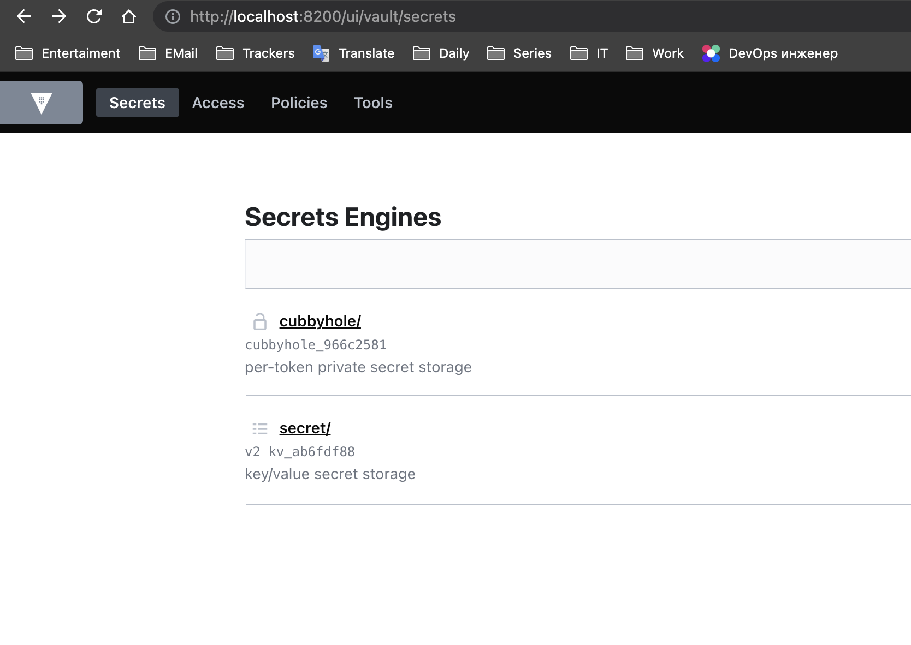
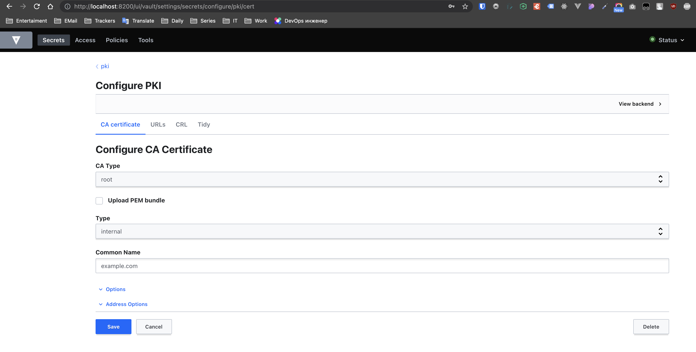
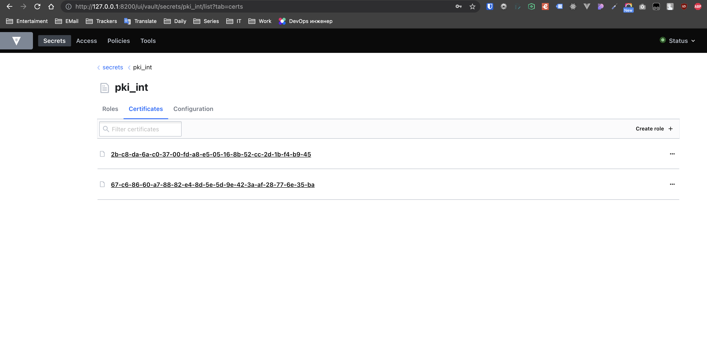
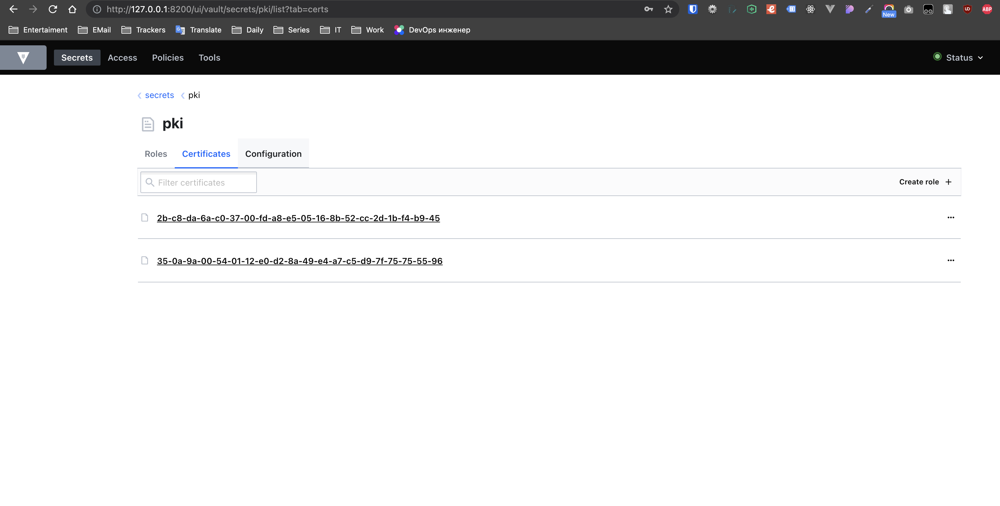
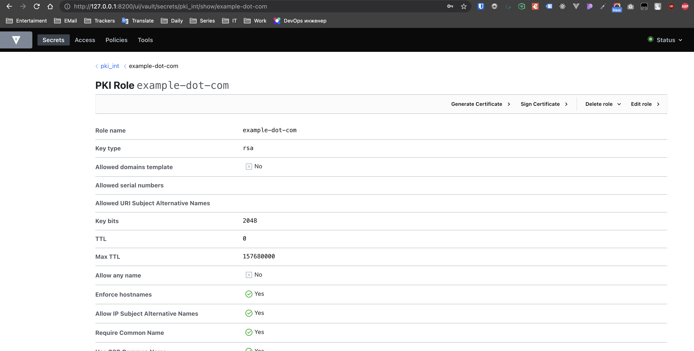
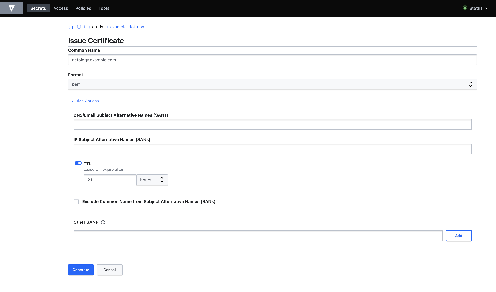

1, 2




3. Используя [PKI Secrets Engine](https://www.vaultproject.io/docs/secrets/pki), создайте Root CA и Intermediate CA.
Обратите внимание на [дополнительные материалы](https://learn.hashicorp.com/tutorials/vault/pki-engine) по созданию CA в Vault, если с изначальной инструкцией возникнут сложности.

Реализовал через UI:






4. Согласно этой же инструкции, подпишите Intermediate CA csr на сертификат для тестового домена (например, `netology.example.com` если действовали согласно инструкции).
  


5. Поднимите на localhost nginx, сконфигурируйте default vhost для использования подписанного Vault Intermediate CA сертификата и выбранного вами домена. Сертификат из Vault подложить в nginx руками.

```
server {
        listen 80 default_server;
        listen [::]:80 default_server;

        # SSL configuration
        #
        listen 443 ssl default_server;
        listen [::]:443 ssl default_server;
        ssl_certificate /etc/nginx/netology.example.com.wokey.pem;
        ssl_certificate_key /etc/nginx/netology.example.com.key;
}
```

6. Модифицировав `/etc/hosts` и [системный trust-store](http://manpages.ubuntu.com/manpages/focal/en/man8/update-ca-certificates.8.html), добейтесь безошибочной с точки зрения HTTPS работы curl на ваш тестовый домен (отдающийся с localhost). Рекомендуется добавлять в доверенные сертификаты Intermediate CA. Root CA добавить было бы правильнее, но тогда при конфигурации nginx потребуется включить в цепочку Intermediate, что выходит за рамки лекции. Так же, пожалуйста, не добавляйте в доверенные сам сертификат хоста.

```
$ cat /etc/hosts | grep netology
127.0.0.1 netology.example.com
$ ll /usr/local/share/ca-certificates/
total 12
drwxr-xr-x 2 root root 4096 Aug  7 13:21 ./
drwxr-xr-x 5 root root 4096 Aug  7 11:20 ../
-rw-r--r-- 1 root root 1346 Aug  7 13:21 intermediate.cert.crt
$ ~/vault$ sudo update-ca-certificates
Updating certificates in /etc/ssl/certs...
1 added, 0 removed; done.
Running hooks in /etc/ca-certificates/update.d...
done.
```

7. [Ознакомьтесь](https://letsencrypt.org/ru/docs/client-options/) с протоколом ACME и CA Let's encrypt. Если у вас есть во владении доменное имя с платным TLS-сертификатом, который возможно заменить на LE, или же без HTTPS вообще, попробуйте воспользоваться одним из предложенных клиентов, чтобы сделать веб-сайт безопасным (или перестать платить за коммерческий сертификат).

https://api.itak.site/ - тут через ZeroSSL серт делал для бекенда недавно
